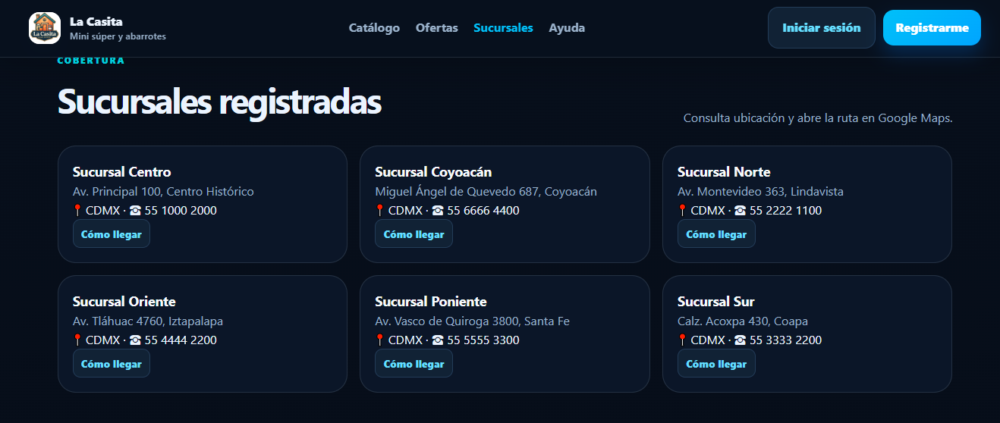
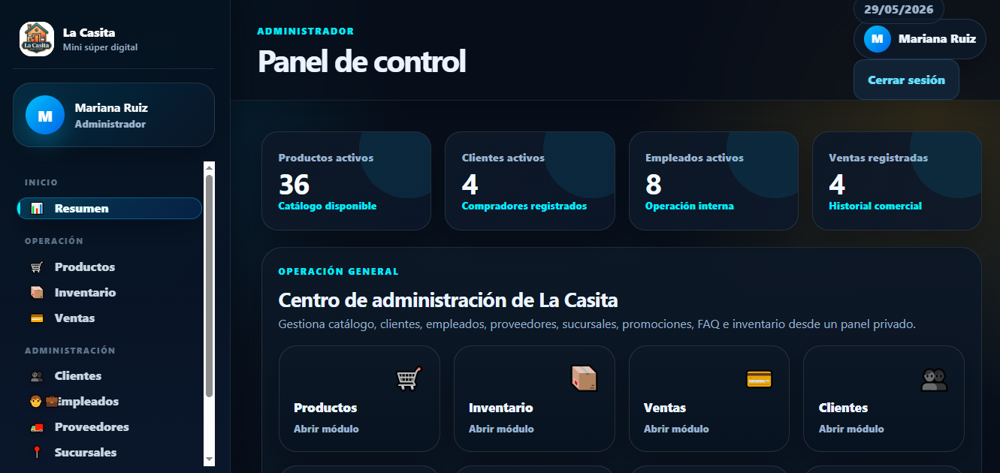
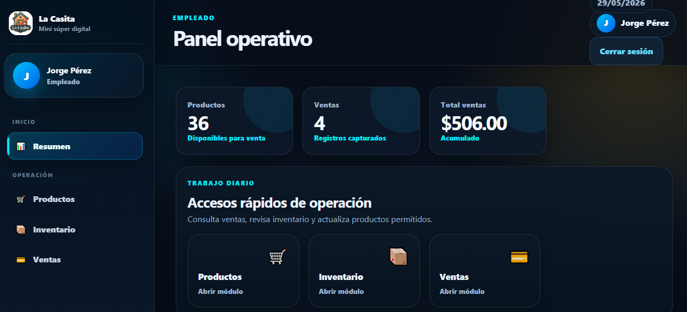

# La Casita - Mini Súper Web con Laravel


## Contenido del repositorio

Este repositorio contiene el código fuente de **La Casita**, una aplicación web para un mini súper desarrollada con Laravel. Además, incluye una carpeta `capturas` con imágenes de las pantallas principales para documentar visualmente el funcionamiento del proyecto en GitHub.

---

## Descripción general

**La Casita** es una aplicación web desarrollada con **Laravel** para administrar y consultar información de un mini súper. El proyecto permite manejar productos, categorías, clientes, empleados, proveedores, sucursales, promociones, inventario, ventas y preguntas frecuentes.

El sistema cuenta con autenticación de usuarios, sesiones protegidas, roles de acceso y vistas diferentes dependiendo del tipo de usuario que inicia sesión.

La aplicación está pensada como un proyecto escolar o prototipo funcional para demostrar el uso de Laravel, MySQL, rutas protegidas, control de roles, operaciones CRUD, sesiones y despliegue en un hosting gratuito como InfinityFree.

---

## Propósito del proyecto

El propósito principal de este proyecto es crear una plataforma web para un mini súper llamado **La Casita**, donde se pueda:

- Mostrar información pública del negocio.
- Permitir el registro e inicio de sesión de usuarios.
- Controlar el acceso según el rol del usuario.
- Administrar productos, clientes, empleados y proveedores.
- Consultar inventario y ventas.
- Mostrar promociones y preguntas frecuentes.
- Permitir a los clientes consultar el catálogo y su historial de compras.
- Demostrar seguridad básica con sesiones, CSRF, hash de contraseñas y middleware.

---

## Tecnologías utilizadas

El proyecto utiliza las siguientes tecnologías:

- **Laravel 12**
- **PHP 8.2 o superior**
- **MySQL / MariaDB**
- **Composer**
- **Blade Templates**
- **HTML**
- **CSS**
- **JavaScript básico**
- **XAMPP para entorno local**
- **phpMyAdmin para administrar la base de datos**
- **InfinityFree para hosting gratuito**
- **FileZilla Client para subir archivos por FTP**

---

## Requisitos para correr el proyecto localmente

Antes de ejecutar el proyecto, se necesita tener instalado:

- XAMPP
- PHP 8.2 o superior
- Composer
- MySQL
- Navegador web
- Editor de texto, por ejemplo Visual Studio Code o Bloc de notas

---

## Estructura principal del proyecto

La estructura general del proyecto es la siguiente:

```txt
LaCasita/
├── app/
│   ├── Http/
│   │   ├── Controllers/
│   │   └── Middleware/
│   └── Models/
├── bootstrap/
├── config/
├── database/
│   ├── migrations/
│   └── seeders/
├── public/
│   ├── assets/
│   │   ├── css/
│   │   └── img/
│   └── index.php
├── resources/
│   └── views/
├── routes/
│   └── web.php
├── storage/
├── capturas/
│   ├── Inicio.png
│   ├── CATALOGO.png
│   ├── Oferta.png
│   ├── Sucursales.png
│   ├── Ayuda.png
│   ├── ADMIN.png
│   ├── EMPLEADO.png
│   └── CLIENTE.png
├── vendor/
├── .env
├── .env.example
├── artisan
├── composer.json
├── composer.lock
└── README.md
```

---

## Carpetas importantes

### `app/Http/Controllers`

Contiene los controladores principales del sistema. Cada controlador se encarga de manejar la lógica de un módulo.

Controladores principales:

- `AuthController.php`: controla login, registro y cierre de sesión.
- `PublicController.php`: carga la página pública.
- `DashboardController.php`: redirige al usuario al panel correspondiente según su rol.
- `ProductoController.php`: administra productos.
- `CategoriaController.php`: administra categorías.
- `ClienteController.php`: administra clientes.
- `EmpleadoController.php`: administra empleados.
- `ProveedorController.php`: administra proveedores.
- `SucursalController.php`: administra sucursales.
- `PromocionController.php`: administra promociones.
- `FaqController.php`: administra preguntas frecuentes.
- `VentaController.php`: consulta ventas.
- `InventarioController.php`: consulta inventario.
- `ClientePanelController.php`: controla el catálogo e historial de compras del cliente.

---

### `app/Http/Middleware`

Contiene middleware personalizado.

- `RoleMiddleware.php`: permite o bloquea rutas dependiendo del rol del usuario.

Ejemplo:

```php
Route::middleware('role:administrador')->group(function () {
    // Rutas solo para administrador
});
```

---

### `app/Models`

Contiene los modelos que representan las tablas de la base de datos.

Modelos incluidos:

- `User.php`
- `Cliente.php`
- `Empleado.php`
- `Puesto.php`
- `Sucursal.php`
- `Categoria.php`
- `Proveedor.php`
- `Producto.php`
- `Inventario.php`
- `MetodoPago.php`
- `Promocion.php`
- `Venta.php`
- `DetalleVenta.php`
- `Faq.php`

---

### `database/migrations`

Contiene la migración que crea la estructura de la base de datos.

Archivo principal:

```txt
2026_05_22_000001_create_lacasita_schema.php
```

Este archivo crea tablas como:

- `usuario`
- `cliente`
- `empleado`
- `puesto`
- `sucursal`
- `categoria`
- `proveedor`
- `producto`
- `inventario`
- `metodo_pago`
- `promocion`
- `producto_promocion`
- `venta`
- `detalle_venta`
- `faq`
- `sessions`
- `cache`
- `jobs`

---

### `database/seeders`

Contiene datos iniciales para probar el sistema.

Archivo principal:

```txt
DatabaseSeeder.php
```

Este archivo carga datos como:

- Usuarios de prueba.
- Clientes.
- Empleados.
- Productos.
- Categorías.
- Proveedores.
- Sucursales.
- Promociones.
- Ventas.
- Preguntas frecuentes.

---

### `resources/views`

Contiene las vistas del sistema hechas con Blade.

Vistas principales:

```txt
resources/views/home.blade.php
resources/views/auth/login.blade.php
resources/views/auth/register.blade.php
resources/views/layouts/public.blade.php
resources/views/layouts/app.blade.php
resources/views/panel/admin.blade.php
resources/views/panel/empleado.blade.php
resources/views/panel/cliente.blade.php
resources/views/panel/catalogo.blade.php
resources/views/panel/compras.blade.php
```

También contiene las vistas administrativas de:

- Categorías
- Clientes
- Empleados
- FAQ
- Inventario
- Productos
- Promociones
- Proveedores
- Sucursales
- Ventas

---

### `public`

Es la carpeta pública del proyecto. Laravel entra por:

```txt
public/index.php
```

También contiene:

```txt
public/assets/css/
public/assets/img/
```

Ahí se guardan los estilos e imágenes usadas por la aplicación.

---

## Roles del sistema

El sistema maneja tres roles principales:

| Rol | Descripción |
|---|---|
| Administrador | Tiene acceso completo a la administración del sistema. |
| Empleado | Tiene acceso operativo a productos, inventario y ventas. |
| Cliente | Puede consultar catálogo y compras. |

---

## Funciones por rol

### Administrador

El administrador puede:

- Iniciar sesión.
- Acceder al panel administrativo.
- Gestionar productos.
- Gestionar categorías.
- Gestionar clientes.
- Gestionar empleados.
- Gestionar proveedores.
- Gestionar sucursales.
- Gestionar promociones.
- Gestionar preguntas frecuentes.
- Consultar inventario.
- Consultar ventas.
- Cerrar sesión.

### Empleado

El empleado puede:

- Iniciar sesión.
- Acceder al panel de empleado.
- Consultar y administrar productos.
- Consultar inventario.
- Consultar ventas.
- Cerrar sesión.

### Cliente

El cliente puede:

- Registrarse.
- Iniciar sesión.
- Acceder al panel de cliente.
- Consultar catálogo de productos.
- Ver promociones.
- Realizar compras desde el catálogo.
- Consultar su historial de compras.
- Cerrar sesión.

---

## Cuentas de prueba

Después de ejecutar los seeders, se pueden usar estas cuentas:

| Rol | Correo | Contraseña |
|---|---|---|
| Administrador | admin@lacasita.com | 123456 |
| Empleado | empleado@lacasita.com | 123456 |
| Cliente | cliente@lacasita.com | 123456 |

---

## Capturas del proyecto

Las siguientes imágenes muestran las pantallas principales del sistema. Para que se visualicen correctamente en GitHub, la carpeta `capturas` debe estar en la raíz del repositorio, al mismo nivel que el archivo `README.md`.

### Página de inicio


---

### Catálogo de productos


---

### Promociones y ofertas


---

### Sucursales



---

### Página de ayuda


---

### Panel de administrador



---

### Panel de empleado



---

### Panel de cliente


---

# Instalación local paso a paso

## 1. Copiar el proyecto

El proyecto debe estar ubicado en:

```txt
C:\xampp\htdocs\LaCasita
```

La estructura debe quedar así:

```txt
C:\xampp\htdocs\LaCasita\artisan
C:\xampp\htdocs\LaCasita\composer.json
C:\xampp\htdocs\LaCasita\.env
```

No debe quedar así:

```txt
C:\xampp\htdocs\LaCasita\LaCasita\artisan
```

---

## 2. Encender XAMPP

Abrir XAMPP Control Panel y encender:

```txt
Apache
MySQL
```

---

## 3. Crear la base de datos local

Entrar a phpMyAdmin:

```txt
http://localhost/phpmyadmin
```

Crear una base de datos llamada:

```txt
lacasita_laravel
```

---

## 4. Configurar el archivo `.env` para local

Abrir el archivo `.env`:

```bash
notepad C:\xampp\htdocs\LaCasita\.env
```

Configurar la base de datos así:

```env
APP_NAME="La Casita"
APP_ENV=local
APP_DEBUG=true
APP_URL=http://127.0.0.1:8000

DB_CONNECTION=mysql
DB_HOST=127.0.0.1
DB_PORT=3306
DB_DATABASE=lacasita_laravel
DB_USERNAME=root
DB_PASSWORD=
```

Guardar el archivo.

---

## 5. Instalar dependencias

Abrir CMD en la carpeta del proyecto:

```bash
cd C:\xampp\htdocs\LaCasita
```

Ejecutar:

```bash
composer install
```

---

## 6. Generar llave de Laravel

Ejecutar:

```bash
php artisan key:generate
```

Si PHP no se reconoce, usar:

```bash
C:\xampp\php\php.exe artisan key:generate
```

---

## 7. Crear tablas y datos iniciales

Ejecutar:

```bash
php artisan migrate:fresh --seed
```

Si PHP no se reconoce:

```bash
C:\xampp\php\php.exe artisan migrate:fresh --seed
```

Este comando borra y vuelve a crear las tablas, además de insertar los datos iniciales.

---

## 8. Limpiar caché

Ejecutar:

```bash
php artisan optimize:clear
```

---

## 9. Ejecutar el servidor local

Ejecutar:

```bash
php artisan serve
```

Debe aparecer algo parecido a:

```txt
Server running on [http://127.0.0.1:8000]
```

---

## 10. Abrir el proyecto

Abrir en el navegador:

```txt
http://127.0.0.1:8000
```

---

# Rutas principales del sistema

## Rutas públicas

```txt
/
```

Página principal del negocio.

```txt
/login
```

Inicio de sesión.

```txt
/registro
```

Registro de cliente.

## Rutas protegidas

```txt
/dashboard
```

Panel principal. Redirige según el rol del usuario.

## Rutas de administrador y empleado

```txt
/productos
/inventario
/ventas
```

## Rutas solo de administrador

```txt
/categorias
/clientes
/empleados
/proveedores
/sucursales
/promociones
/faqs
```

## Rutas de cliente

```txt
/cliente/catalogo
/cliente/compras
```

---

# Seguridad implementada

El proyecto incluye varias medidas básicas de seguridad.

## Sesiones protegidas

Laravel maneja sesiones del lado del servidor. Si una persona copia una URL privada y la abre en incógnito, no podrá entrar porque no tiene una sesión iniciada.

## Middleware `auth`

Las rutas privadas están protegidas con el middleware:

```php
auth
```

Esto obliga a que el usuario inicie sesión antes de entrar a ciertas rutas.

## Middleware por rol

El sistema usa middleware personalizado para validar roles:

```php
role:administrador
role:administrador,empleado
role:cliente
```

De esta forma, aunque un usuario conozca una URL, no podrá acceder si su rol no tiene permiso.

## Contraseñas con hash

Las contraseñas no se guardan en texto plano. Se guardan usando hash mediante Laravel.

## Protección CSRF

Los formularios usan:

```blade
@csrf
```

Esto evita envíos falsos de formularios desde sitios externos.

## Validaciones del lado del servidor

Los formularios validan datos antes de guardar información en la base de datos.

## Protección contra SQL Injection

El proyecto usa Eloquent ORM y Query Builder, evitando concatenar SQL manual con datos escritos por el usuario.

---

# Prueba de seguridad sugerida

Para comprobar que las rutas están protegidas:

1. Iniciar sesión como administrador.
2. Copiar la URL del dashboard.
3. Abrir una ventana de incógnito.
4. Pegar la URL.
5. El sistema debe redirigir al login.
6. Esto demuestra que la URL no se puede abrir sin sesión activa.

---

# Configuración para InfinityFree

InfinityFree es un hosting gratuito que permite subir proyectos PHP y MySQL. Sin embargo, tiene una limitación importante:

```txt
No permite usar SSH.
No permite ejecutar composer install en el servidor.
No permite ejecutar php artisan en el servidor.
```

Por esa razón, el proyecto debe prepararse localmente y luego subirse ya listo.

---

## Preparar proyecto para InfinityFree

### 1. Crear una copia del proyecto

Desde CMD:

```bash
cd C:\xampp\htdocs
xcopy LaCasita LaCasitaDeploy /E /I /H
```

Trabajar con la copia:

```txt
C:\xampp\htdocs\LaCasitaDeploy
```

---

### 2. Entrar a la copia

```bash
cd C:\xampp\htdocs\LaCasitaDeploy
```

---

### 3. Instalar dependencias sin desarrollo

```bash
composer install --no-dev --prefer-dist
```

---

### 4. Limpiar caché

```bash
php artisan optimize:clear
```

---

### 5. Configurar `.env` para InfinityFree

Abrir:

```bash
notepad C:\xampp\htdocs\LaCasitaDeploy\.env
```

Ejemplo de configuración:

```env
APP_NAME="La Casita"
APP_ENV=production
APP_KEY=DEJAR_LA_LLAVE_GENERADA_POR_LARAVEL
APP_DEBUG=false
APP_URL=https://lacasita.infinityfreeapp.com

DB_CONNECTION=mysql
DB_HOST=sql210.infinityfree.com
DB_PORT=3306
DB_DATABASE=if0_41973918_lacasita
DB_USERNAME=if0_41973918
DB_PASSWORD=TU_CONTRASEÑA_MYSQL

SESSION_DRIVER=file
SESSION_LIFETIME=120
SESSION_ENCRYPT=false
SESSION_PATH=/
SESSION_DOMAIN=null

CACHE_STORE=file
QUEUE_CONNECTION=sync
FILESYSTEM_DISK=local
MAIL_MAILER=log
```

Importante:

```txt
No dejar APP_DEBUG=true en producción.
No poner XXX en DB_DATABASE.
Usar el nombre real de la base de datos.
No cambiar APP_KEY si ya funciona localmente.
```

---

# Crear base de datos en InfinityFree

En InfinityFree:

1. Entrar al panel de control.
2. Ir a MySQL Databases.
3. Crear una base de datos.
4. Copiar los datos de conexión.

Datos usados en este proyecto:

```env
DB_HOST=sql210.infinityfree.com
DB_PORT=3306
DB_DATABASE=if0_41973918_lacasita
DB_USERNAME=if0_41973918
DB_PASSWORD=TU_CONTRASEÑA_MYSQL
```

---

# Exportar base de datos local

Entrar a:

```txt
http://localhost/phpmyadmin
```

Seleccionar:

```txt
lacasita_laravel
```

Luego:

```txt
Exportar → Rápido → SQL → Continuar
```

Se descargará un archivo `.sql`.

---

# Importar base de datos en InfinityFree

En InfinityFree:

1. Entrar al panel.
2. Abrir phpMyAdmin.
3. Seleccionar la base de datos creada.
4. Ir a Importar.
5. Seleccionar el archivo `.sql`.
6. Presionar Continuar.

---

# Subir archivos a InfinityFree

Para subir el proyecto se recomienda usar **FileZilla Client**, no el administrador de archivos web, porque Laravel tiene muchos archivos y la carpeta `vendor` puede ser muy pesada.

## Datos FTP de InfinityFree

En InfinityFree entrar a:

```txt
Control Panel → FTP Accounts
```

Usar datos parecidos a:

```txt
Host: ftpupload.net
Usuario: if0_41973918
Contraseña: contraseña FTP
Puerto: 21
```

## Configurar FileZilla

En FileZilla:

```txt
Editar → Opciones → Transferencias
```

Configurar:

```txt
Máximo de transferencias simultáneas: 1
```

Esto ayuda a que no fallen tantos archivos al subir `vendor`.

---

## Subida recomendada

### 1. Entrar a `htdocs`

En el lado derecho de FileZilla entrar a:

```txt
/htdocs
```

Borrar archivos por defecto como:

```txt
index2.html
```

---

### 2. Subir todo menos `vendor`

Desde:

```txt
C:\xampp\htdocs\LaCasitaDeploy
```

Subir todo menos la carpeta:

```txt
vendor
```

La estructura en InfinityFree debe quedar así:

```txt
htdocs/app
htdocs/bootstrap
htdocs/config
htdocs/database
htdocs/public
htdocs/resources
htdocs/routes
htdocs/storage
htdocs/.env
htdocs/artisan
htdocs/composer.json
htdocs/composer.lock
```

No debe quedar así:

```txt
htdocs/LaCasitaDeploy/app
```

Debe quedar directo dentro de `htdocs`.

---

### 3. Subir `vendor` por partes

Crear en el servidor:

```txt
htdocs/vendor
```

Subir carpetas de `vendor` poco a poco, por ejemplo:

```txt
vendor/composer
vendor/laravel
vendor/symfony
vendor/psr
vendor/nesbot
vendor/monolog
vendor/vlucas
vendor/guzzlehttp
vendor/brick
vendor/carbonphp
vendor/doctrine
vendor/egulias
vendor/fruitcake
vendor/graham-campbell
vendor/nunomaduro
vendor/ramsey
vendor/tijsverkoyen
```

Después subir las demás carpetas que falten.

Al final debe existir:

```txt
htdocs/vendor/autoload.php
```

Si ese archivo no existe, Laravel no podrá iniciar.

---

# Crear `.htaccess` principal en InfinityFree

Dentro de:

```txt
htdocs
```

crear un archivo llamado:

```txt
.htaccess
```

Contenido:

```apache
RewriteEngine On
RewriteRule ^(.*)$ public/$1 [L]
```

Este archivo redirige las peticiones hacia la carpeta `public`, que es donde debe iniciar Laravel.

Importante: no borrar el archivo:

```txt
htdocs/public/.htaccess
```

Deben existir ambos:

```txt
htdocs/.htaccess
htdocs/public/.htaccess
```

---

# Carpetas necesarias en InfinityFree

Verificar que existan:

```txt
htdocs/storage
htdocs/storage/framework
htdocs/storage/framework/cache
htdocs/storage/framework/cache/data
htdocs/storage/framework/sessions
htdocs/storage/framework/views
htdocs/bootstrap/cache
```

Si alguna no existe, crearla manualmente desde FileZilla.

---

# Abrir el sitio en InfinityFree

Entrar al dominio:

```txt
https://lacasita.infinityfreeapp.com
```

No entrar con:

```txt
https://lacasita.infinityfreeapp.com/public
```

---

# Problemas comunes en InfinityFree

## Error 500

Revisar:

```txt
1. Que htdocs/vendor/autoload.php exista.
2. Que htdocs/.env exista.
3. Que htdocs/.htaccess exista.
4. Que htdocs/public/.htaccess exista.
5. Que la base de datos esté importada.
6. Que DB_DATABASE tenga el nombre completo de la base.
7. Que DB_HOST sea el de InfinityFree.
8. Que DB_PASSWORD sea correcto.
9. Que APP_DEBUG esté en false.
10. Que storage/framework/sessions exista.
11. Que bootstrap/cache exista.
```

## Error de base de datos

Revisar estos datos en `.env`:

```env
DB_CONNECTION=mysql
DB_HOST=sql210.infinityfree.com
DB_PORT=3306
DB_DATABASE=if0_41973918_lacasita
DB_USERNAME=if0_41973918
DB_PASSWORD=TU_CONTRASEÑA_MYSQL
```

## El proyecto abre en blanco

Revisar:

```txt
vendor/autoload.php
public/index.php
.env
APP_KEY
.htaccess
```

## No cargan imágenes o CSS

Revisar que exista:

```txt
htdocs/public/assets/css
htdocs/public/assets/img
```

También revisar que `APP_URL` tenga el dominio correcto.

---

# Comandos útiles en local

Entrar al proyecto:

```bash
cd C:\xampp\htdocs\LaCasita
```

Correr local:

```bash
php artisan serve
```

Limpiar caché:

```bash
php artisan optimize:clear
```

Recrear base de datos:

```bash
php artisan migrate:fresh --seed
```

Instalar dependencias:

```bash
composer install
```

Instalar dependencias para producción:

```bash
composer install --no-dev --prefer-dist
```

Generar llave:

```bash
php artisan key:generate
```

---

# Notas importantes

- No subir el archivo `.env` a GitHub.
- No publicar contraseñas reales.
- Cambiar las contraseñas de prueba si el sitio se deja público.
- En producción usar `APP_DEBUG=false`.
- No borrar la carpeta `vendor`.
- No borrar `public/.htaccess`.
- No subir el proyecto dentro de otra carpeta en `htdocs`.
- Para InfinityFree, subir `vendor` por FileZilla y por partes.
- Si FileZilla marca archivos fallidos, volver a ponerlos en cola hasta que se suban.

---

# Estado del proyecto

El proyecto cuenta con:

- Página pública.
- Login funcional.
- Registro de cliente.
- Sesiones protegidas.
- Roles de usuario.
- Panel de administrador.
- Panel de empleado.
- Panel de cliente.
- CRUD de productos.
- CRUD de categorías.
- CRUD de clientes.
- CRUD de empleados.
- CRUD de proveedores.
- CRUD de sucursales.
- CRUD de promociones.
- CRUD de FAQ.
- Consulta de inventario.
- Consulta de ventas.
- Catálogo para cliente.
- Historial de compras para cliente.
- Validaciones.
- Protección CSRF.
- Contraseñas cifradas con hash.
- Datos iniciales con seeders.

---

# Conclusión

La aplicación web **La Casita** permite demostrar el funcionamiento de un sistema administrativo básico para un mini súper usando Laravel y MySQL. El proyecto integra autenticación, sesiones, roles, operaciones CRUD, vistas diferenciadas y medidas básicas de seguridad.

Además, puede ejecutarse localmente con XAMPP y también puede desplegarse en InfinityFree, siempre que se suba correctamente la carpeta `vendor`, el archivo `.env`, la base de datos y los archivos `.htaccess`.
